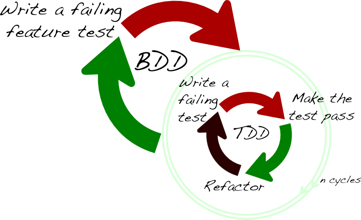

# Chem Trail

A simple app for tracking pharmacy opening hours so you can plan your
pseudo-ephedrine buying spree. Also learn Rails testing.

----

## TDD

Let's revise what makes code good (according to one of my programming heroes,
Corey Haines):

**Good code is easy to change** and code is easy to change when it is:

1. Verifiable
2. Easy to understand
3. No repetition
4. Concise

Note that Verifiable is number 1. We could ask a QA to sit and verify our code
any time we change it. Or we could do it ourselves. That works but it ends up
being very very time consuming. Automated testing is intended to make
requirement 1 much much faster.

Here is the TDD workflow:


Notice that tests are written first. This is intended to force you to plan and
think about how your classes are going to work together before you get stuck
into writing them. It's not a strict rule, however, and if you don't know where
to begin, it's worth writing a *prototype* first. A prototype, according to me,
is code without tests, that is written with an experimental or exploratory
intention.

Did you feel like the more you worked on your project, the more you ran up
against fiddly bugs that slowed you down and even stopped your progress
completely? Testing is intended to help you continue to make progress
even on very complex projects.

The main way testing helps you keep moving forward even with high complexity is
by catching **regressions** which are bugs caused accidentally in code while
you were busy trying to add a new feature or fix a bug.

That is, the idea is to run all your tests after each change to the code.

### Set up RSpec

* Add RSpec to `Gemfile`:

  ```ruby
  gem 'rspec-rails', groups: [:development, :test]
  ```

* Install RSpec

  ```
  bundle
  ```

* Run RSpec install generator

  ```
  rails g rspec:install
  ```

### Set up Simplecov

* Add simplecov to `Gemfile`

  ```ruby
  gem 'simplecov', require: false, group: :test
  ```

* Add simplecov to `spec/spec_helper.rb`

  ```ruby
  require 'simplecov'
  SimpleCov.start 'rails'
  ```

### Create our first test

* Create a unit test.

  ```
  rails g rspec:model OpenPeriod
  ```

* Edit it:

  ```ruby
  require 'rails_helper'

  RSpec.describe OpenPeriod, type: :model do
    describe '#formatted' do
      it 'should format the open period 9-5 on Monday' do
        period = OpenPeriod.new(day: "Monday", time_from: "09:00", time_to: "05:00")
        expect(period.formatted).to eq 'Monday: 9:00am - 5:00pm'
      end
    end
  end
  ```

### Run the tests and implement the feature

* Run the tests:

  ```
  rake db:test:prepare
  rspec
  open coverage/index.html
  ```

* Implement `OpenPeriod#formatted` to make the test pass.

### Doubles and unit test isolation

Classes almost always refer to other classes. These are called dependencies.
The more dependencies each unit has, the more *knotty* and difficult to manage
your program is likely to be. However such dependencies are inevitable and
desirable to achieve whatever functionality you're aiming for.

There are a few ways to elegantly manage dependencies in the context of
testing.

The first trick is to pass in fake objects that are created by the test
framework, instead of real objects of the real classes required. Fake objects
can be set up to monitor what functions are called on them and make assertions,
or to always provide a consistent answer to avoid external calculation or
complexity. Such fake objects are called **doubles** (also sometimes called
mocks or stubs), like an actor who pretends to be a
famous person. I think the movie [The Truman Show](https://en.wikipedia.org/wiki/The_Truman_Show)
is a great way to think about isolation and doubles. Truman is the object under
test - the only "real" object, and everything around him is fake and set up to
help us examine him.

The second trick is to write your unit (class) in such a manner that any
dependencies (other objects or classes) it uses are passed into it, either in
its constructor or in arguments to functions. That way, when the class is under
test, the test framework can pass in fake objects easily. This concept is
called **dependency injection**. In the Truman example, we never let Truman go
and find his own doctor, lawyer, etc., as he might end up finding a real one!
Instead we force him to use the ones that we provide to him. Fake ones.

* Edit `spec/models/pharmacy_spec.rb`:

  ```ruby
  require 'rails_helper'

  RSpec.describe Pharmacy, type: :model do
    describe '#open_periods_formatted' do
      it 'should format all open periods' do
        pharmacy = Pharmacy.new(name: "Balmain")
        allow(pharmacy).to receive_messages(open_periods: [
          object_double(OpenPeriod.new, day: "Monday", time_from: Time.new(2000, 1, 1, 9, 0)),
          object_double(OpenPeriod.new, day: "Tuesday", time_from: Time.new(2000, 1, 1, 9, 0)),
        ])
        expect(pharmacy.open_periods_formatted).to eq "Monday: 9am - 5pm\nTuesday: 9am - 5pm"
      end
    end
  end
  ```

* Run the tests:

  ```
  rspec
  ```

* Implement `Pharmacy#open_periods_formatted` to make the test pass.

### Controller and view specs

* Generate some controller and view specs:

  ```
  rails g scaffold pharmacy name
  ```

* Look at and update the controller and view specs until they pass and none are skipped.

* Check what the coverage is.


## Factories

There are a few ways to create data for tests to run on:

* Use your application's APIs (such as your Rails models) at the start of each.
* Use fixtures, which are constant test scenario data, re-useable across all tests.
* Use "factory" libraries, which are intended to provide ultra convenient ways
  to create Rails models and objects at the start of each test scenario.

Fixtures were popular when Rails first came along. The functionality for them
is built into Rails. But after developers used them for a while, they found
that large suites of tests were unmaintainable, since each fixture was re-used
between tests and this made it difficult to change them without breaking half
the tests.

Directly using Rails models was deemed difficult because often most of the
attributes on each model are unrelated to the test scenario, in which case the
work required in each test is unnecessarily high.

Factories are classes and functions that are designed to create Ruby objects
and Rails models conveniently by specifying a whole lot of default values that
are only used in the test environment. That way, each test can create records
and just specify the data that is relevant to the test. The test reads better
and there is less work to do when writing each test.

NB: There are some people who also don't like factories and argue that if your
Rails app's API is inconvenient to use, you should improve it rather than using
factories to get around the problem. I'm not sure how they handle providing
numerous test environment specific default values to Rails models, though.

### Install FactoryGirl and set it up

* Add to `Gemfile`:

  ```ruby
  # factories
  group :test do
    gem 'factory_girl_rails'
  end
  ```

* Install:

  ```
  bundle
  ```

* Add some factory definitions to `spec/factories/pharmacy.rb`:

  ```ruby
  FactoryGirl.define do
    factory :pharmacy do
      name "Chemical Warehouse"

      trait :late_night_thursday do
        open_periods {
          [build(:open_period, day: "Thursday", time_to: "21:00")]
        }
      end
    end

    factory :open_period do
    end
  end
  ```

And add a test that uses the factory definitions to `spec/models/pharmacy_spec.rb`:

  ```ruby
    it 'should use a factory' do
      pharmacy = FactoryGirl.create(:pharmacy, open_periods: [
        FactoryGirl.build(:open_period, day: "Monday", time_from: '09:00'),
        FactoryGirl.build(:open_period, day: "Tuesday", time_from: '09:00'),
      ])
      expect(pharmacy.open_periods_formatted).to eq "Monday: 9am - 5pm\nTuesday: 9am - 5pm"
    end
  ```

Run it:

  ```
  rspec spec/models/pharmacy_spec.rb
  ```

Notice how we didn't have to specify the `name` of the pharmacy when we created
it in the test, even though `name` is a required attribute of `Pharmacy`. We
could also set any defaults we liked for all attributes involved.

----

## BDD

Behaviour driven development is all about automating a QA person clicking
through your site by writing a script that does that. Then you can run this
script as many times as you want to rapidly verify whether or not you have
implemented a feature. It treats your whole web app as a black box and
restricts itself to doing things that a regular human could do via a web
browser.

It's called "driven development" because by writing an acceptance test first,
you can progressively implement a feature until it half passes, 3/4 passes, and
then fully passes. Running the test each time tells you where you're up to.

This is what that looks like, in diagram form:



Notice the way that multiple TDD Red-Green-Refactor cycles fit inside one BDD
cycle.

### Set up RSpec acceptance testing

Add to `Gemfile`:

  ```ruby
  # acceptance testing
  gem 'nested_form'          # forms for nested resources
  gem 'puma'                 # faster than webrick, used by tests
  group :test do
    gem 'database_cleaner'   # handle truncating tables
    gem 'capybara'           # acceptance test syntax for feature specs
    gem 'launchy'            # lets us save_and_open_page in feature specs
    gem 'selenium-webdriver' # remote control firefox
  end
  ```

Install these things:

  ```
  bundle
  ```

Run

  ```
  rails g rspec:feature ManagePharmacies
  ```

Edit the file `spec/features/manage_pharmacies_spec.rb`:

  ```ruby
  require 'rails_helper'

  RSpec.feature "Manage pharmacies", type: :feature do
    it 'should do stuff' do
      visit '/pharmacies'
      click_on 'New Pharmacy'
      fill_in 'Name', with: 'Ultimo Chemist Plus'
      click_on 'Create Pharmacy'
      expect(page).to have_content 'successfully created'
      click_on 'Back'
      expect(page).to have_content 'Ultimo Chemist Plus'
    end
  end
  ```

Run it:

  ```
  rspec spec/features/manage_pharmacies_spec.rb
  ```

**Check**: Make sure it's passing. It should pass with the built in scaffolding.

### Rails acceptance testing with JavaScript

  ```ruby
  require 'rails_helper'

  RSpec.feature "Manage pharmacies", type: :feature, js: true do
    it 'should do stuff' do
      visit '/pharmacies'

      click_on 'New Pharmacy'
      fill_in 'Name', with: 'Ultimo Chemist Plus'

      click_on 'Add an open period'
      fill_in 'Day', with: 'Thursday'
      fill_in 'Time from', with: '09:00 am'
      fill_in 'Time to', with: '08:00 pm'

      click_on 'Create Pharmacy'
      expect(page).to have_content 'successfully created'

      click_on 'Back'
      within('tr', text: 'Ultimo Chemist Plus') do
        click_on 'Show'
      end
      expect(page).to have_content 'Thursday'
    end
  end
  ```

This functionality requires JavaScript, but the basic configuration we have set
up does not allow us to execute JavaScript on our pages. Note the `js: true`
added at the top. We are telling Capybara to execute this acceptance test using
a *driver* that supports JavaScript. There are lots of drivers Capybara can use
to do automated browser testing. To give you an idea,

* the default option, `racktest`, uses something a bit like RSpec controller
  tests to make GET and POST requests to your app,
* the `Selenium` driver pops open Firefox and remotely controls it, and
* the `Poltergeist` driver does the same thing with a browser library called
  Webkit, without actually popping up the browser window (such drivers are
  called "headless" because they have no visible window).

One problem we'll face is that we'll need to clean out our test database before
we run each acceptance test. Otherwise the data we add in our acceptance test
script will accumulate each time we run the test. Data from previous tests may
even make the current acceptance test fail. That is what we added the
`database_cleaner` gem for. But we have to configure it.

Create a file `spec/support/database_cleaner.rb`

  ```ruby
  RSpec.configure do |config|

    config.use_transactional_fixtures = false

    config.before(:suite) do
      DatabaseCleaner.clean_with(:truncation)
    end

    config.before(:each) do |example|
      DatabaseCleaner.strategy = example.metadata[:js] ? :truncation : :transaction
      DatabaseCleaner.start
    end

    config.after(:each) do
      DatabaseCleaner.clean
    end

  end
  ```

Add to `spec/rails_helper.rb` at the bottom.

  ```ruby
  require './spec/support/database_cleaner'
  ```

### Run the failing acceptance test

Make sure you run the test to see that it fails, before you start implementing it.

  ```
  rspec spec/features/manage_pharmacies_spec.rb
  ```

Firefox should pop up under the remote control of this test script, and then
the test should fail with a meaningful message that implies you haven't built
this feature yet. You may also have to install Firefox if you don't already
have it.

### Implement the acceptance test

Update `app/models/pharmacy.rb`

  ```ruby
  accepts_nested_attributes_for :open_periods, allow_destroy: true
  ```

Update `app/controllers/pharmacies_controller.rb`

  ```ruby
  params.require(:pharmacy).permit(:name, open_periods_attributes: [:id, :day, :time_from, :time_to, :_destroy])
  ```

Update `app/views/pharmacies/_form.html.erb`

  ```erb
  <%= nested_form_for(@pharmacy) do |f| %>
  ```

  ```erb
  <%= f.fields_for :open_periods do |open_period_form| %>
    <%= open_period_form.label :day %>
    <%= open_period_form.text_field :day %>

    <%# some other stuff here ... %>

    <%= open_period_form.link_to_remove "Remove this open period" %>
  <% end %>
  <p><%= f.link_to_add "Add an open period", :open_periods %></p>
  ```

Add to `app/assets/javascripts/application.js`:

  ```js
  //= require jquery_nested_form
  ```

Run the test each time you think another step or two will pass.

  ```
  rspec spec/features/manage_pharmacies_spec.rb
  ```

You will have to implement more Rails code before it passes. When doing so, try
using TDD to build the little bits and pieces you need.
